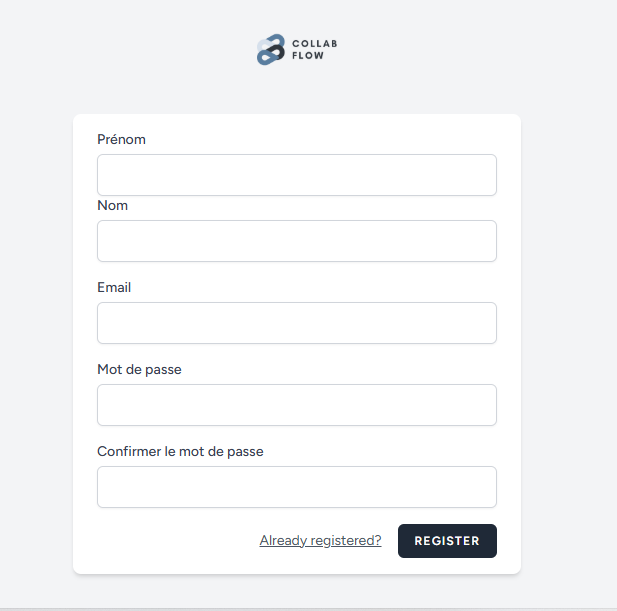
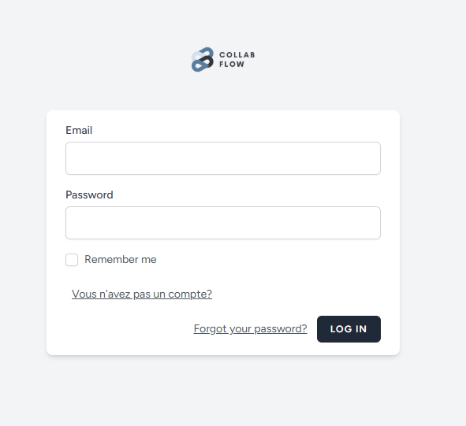
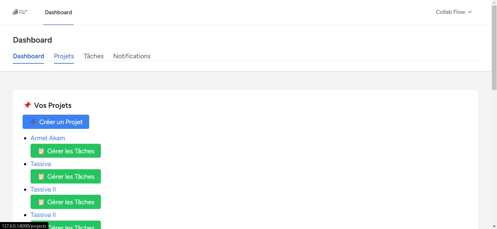
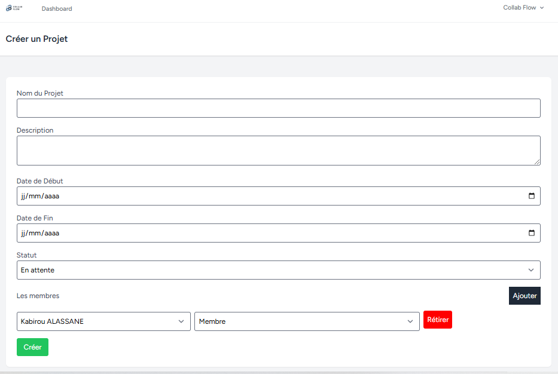
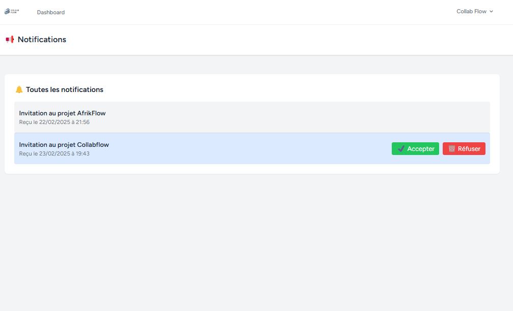

# 📌 Application de Gestion de Projets Collaboratifs

## 🚀 Introduction
Bienvenue dans l'application de gestion de projets collaboratifs ! Cette application permet aux utilisateurs de créer, gérer et suivre l'avancement de leurs projets en équipe. Elle intègre un système de gestion des tâches, des notifications en temps réel et des rôles d'utilisateur pour une collaboration efficace.

---

## 📸 Aperçu de l'Application

### 👥 Gestion des utilisateurs
- Inscription et authentification avec Laravel.






### 🎯 Tableau de bord (Dashboard)
Le tableau de bord affiche tous les projets auxquels l'utilisateur participe avec un aperçu des tâches et de leur avancement.



### 📁 Gestion des projets
- Création de nouveaux projets avec titre, description et dates.
- Attribution de rôles (Admin, Membre, Spectateur).
- Suivi de l'état du projet (En cours, Terminé, En attente).



### ✅ Gestion des tâches
- Ajout, modification et suppression de tâches.
- Assignation des tâches aux membres du projet.


### ✉️ Notifications
- Notifications par email pour les nouvelles tâches et échéances.
- Notifications en temps réel via Laravel Echo (optionnel).



---

## 🛠️ Installation et Configuration

### 📌 Prérequis
Assurez-vous d'avoir installé les éléments suivants :
- PHP >= 8.1
- Composer
- MySQL
- Node.js & npm
- Laravel 10+

### 🚀 Installation
1. **Cloner le dépôt**
```bash
git clone  https://github.com/Carmel-H/Projet_Laravel_CollabFlow2.git
cd votre-repo
```

2. **Installer les dépendances**
```bash
composer install
npm install
```

3. **Configurer l'environnement**
Copiez le fichier `.env.example` et renommez-le en `.env`, puis mettez à jour vos configurations (DB, MAIL, REDIS, etc.).
```bash
cp .env.example .env
```

4. **Générer la clé d’application**
```bash
php artisan key:generate
```

5. **Exécuter les migrations et seeders**
```bash
php artisan migrate --seed
```

6. **Lancer le serveur**
```bash
php artisan serve
```

7. **Compiler les assets front-end**
```bash
npm run dev
```

L'application sera accessible sur `http://localhost:8000`

---

## 📜 API Endpoints
| Méthode | Endpoint | Description |
|---------|---------|-------------|
| GET | `/api/projects` | Récupérer tous les projets |
| POST | `/api/projects` | Créer un nouveau projet |
| GET | `/api/tasks/{id}` | Récupérer les tâches d'un projet |
| PUT | `/api/tasks/{id}` | Mettre à jour une tâche |
| DELETE | `/api/tasks/{id}` | Supprimer une tâche |

---

## 🤝 Contribution
1. Forker le projet.
2. Créer une nouvelle branche (`git checkout -b feature-nouvelle-fonctionnalite`).
3. Commiter vos modifications (`git commit -m 'Ajout de nouvelle fonctionnalité'`).
4. Pousser la branche (`git push origin feature-nouvelle-fonctionnalite`).
5. Ouvrir une Pull Request.

---

## ⚖️ Licence
Ce projet est sous licence MIT. Voir le fichier [LICENSE](LICENSE) pour plus de détails.

---

## 📞 Support
Si vous avez des questions ou des suggestions, n'hésitez pas à ouvrir une issue ou à me contacter sur sedekoncarmel@gmail.com.

=======
